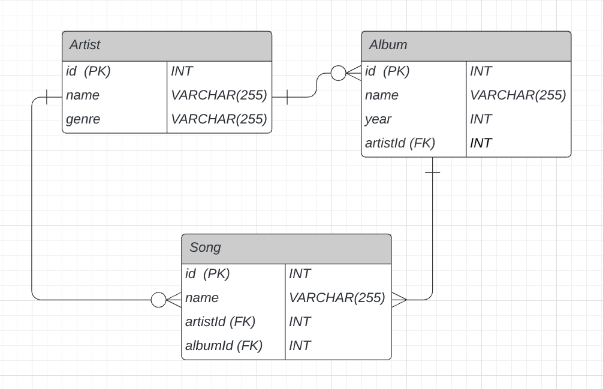

# Music Library API
*A back-end bootcamp project* <br>

The music library SQL database stores information about artists, albums and songs. A CRUD (Create Read Update Delete) RESTful API is implemented to interact with the music library.
 ___  

 ### Project status

Complete

---  

### Tech Stack

- Node.js
- Express
- JavaScript 
- Sequelize
- MySQL  
- Docker


---

## Contents
- [Getting Started](#getting-started)  

- [Overview](#overview)  
&nbsp; - [Database overview](#music-library-database)  
&nbsp; - [Express App overview](#the-app)   
&nbsp; &nbsp; &nbsp; &nbsp; - [Sequelize Models](#models)

- [Sending requests](#sending-requests)  
&nbsp;  - [CRUD artists](#artists)   
&nbsp;  - [CRUD albums](#albums)  
&nbsp; &nbsp; &nbsp; &nbsp; - [Setting foreign keys in Sequelize](#setting-foreign-keys-in-sequelize)  
&nbsp;  - [CRUD songs](#songs)  
&nbsp; &nbsp; &nbsp; &nbsp; - [Using Sequelize - includes](#sequelize---includes)


---  

## Getting Started

You will need a local installation of mysql for this project. We've achieved this using Docker. To do the same for Windows or Mac, [download Docker Desktop](https://docs.docker.com/get-docker/). Once that has installed, make sure it is running, open up your terminal and pull and run a MySQL image with:

```
docker run -d -p 3307:3306 --name music_library_mysql -e MYSQL_ROOT_PASSWORD=<PASSWORD> mysql
```
Replace `<PASSWORD>` with a password of your choice.

It's useful to have MySQL workbench to connect directly to our database. Download it [here](https://dev.mysql.com/downloads/workbench/) or on Linux run `$ sudo apt install mysql-workbench`.

Open MySQL workbench and connect to the MySQL container music_library_mysql with parameters:  

  host: 127.0.0.1  
  port: 3307    
  password: whatever you set it to when you ran the container  

Next, fork this repo then clone your forked copy on to your machine. Run `$ npm install` to grab the project dependencies. 

You'll need to create a `.env` file to store environmental variables for the database:

```
DB_PASSWORD=<your chosen password>
DB_NAME=<your chosen name>
DB_USER=root
DB_HOST=localhost
DB_PORT=3307
``` 

And a `.env.test` file for the test database (the same except for the DB_NAME):
```
DB_PASSWORD=<your chosen password>
DB_NAME=<your chosen name>_test
DB_USER=root
DB_HOST=localhost
DB_PORT=3307
```
Add both these env files to `.gitignore`.

The app is set to run on port 4000. If you'd like to change this, do so in `index.js` by changing the value of `APP_PORT` on line 3.  

___

## Overview  

### Music Library Database 

The database consists of 3 tables: artists, albums and songs.

Here is an ERD (Entity Relationship Diagram) of the Music Library Database:  


  
As you can see, there are 3 entities, each representing the type of entries that can be made into each table. In the left-hand column of each you can see the fields and in the right-hand column the corresponding datatypes. In this database we only have 2 different datatypes: medium integers (int) and strings (varchar(255)). 255 is the maximum length of the string. 

Each entity has a **primary key**, noted in the diagrams as (PK). Primary keys are a unique identifying property, and in this database the ids of each entry function as the primary key. FK stands for **foreign key** and creates associations between tables. Every album has an artist, and the primary key of its corresponding artist is set as the album's foreign key, stored under the column **artistId**. This links the tables.

Songs have 2 foreign keys, artist and album, which again will be the primary keys of each. Setting these associations mean we can, for example, pull up the connected artist and album records when we retrieve a song.

The final thing to note in the diagram are the connecting lines representing the relationships between the entities. An artist can have 0 or many albums, so the end of the line connecting to Album has a circle representing zero, and 3 lines representing many. The same for the end of the connecting line reaching Song. A song or an album, however, in this database for simplicity's sake, have one and only one artist. They cannot be created without being associated with an artist. A song also has one and only one album. This relationship is represented by the single line crossing the line's end connecting Artist to Album, Song to Artist and Song to Album.
  
***

### The App

App directory structure (minus tests)

```
music-library-api/  
  |-- index.js  
  |__src/  
      |-- controllers/  
      |-- middleware/  
      |-- models/  
      |-- routes/  
      |-- app.js  
```

`index.js` is the entry point. Here we import our app, set the port and tell it to listen to that port. All the fun stuff happens in `src`.

In `app.js` we declare our app object using `express()`, import our routes and set them up on the app with `app.use()`.

<br /> 

**Routes**

```
routes/  
  |--albums.js  
  |--artists.js  
  |--songs.js  
```
In each file you'll find the routes for the 3 possible paths of /artists, /albums and /songs. Middleware and controller functions are passed to each call on the router. For example:  

```
albumsRouter.post('/artists/:artistId', checkArtistId, createAlbum)
```  
Here we are handling the path `'/albums/artists/:artistId'` (the first portion '/albums' is set when we call `app.use` in `app.js`). When a request comes into this route, the id passed in the route parameter artistId will be checked by middleware function `checkArtistId`. Then, if this doesn't generate a '404 Not Found' response, the final middleware, the controller createAlbum, will be called and send a response back to the client.

`checkArtistId` and other custom middleware serving to validate requests can be found in `middleware/validation/index.js`.  

<br /> 

**Controllers**  
  
```
controllers/  
  |--albums.js  
  |--artists.js  
  |--songs.js  
```
The controllers make use of Sequelize methods to interact with the database, CRUD-ing (Creating, Reading, Updating and Deleting) records. For example:

```
// controllers/songs.js  

exports.listSongs = (req, res) => {
  Song.findAll().then(songs => res.status(200).json({ songs }))
}
```

Here we call a Sequelize method findAll on our Song model (more on that shortly). Because we have passed no parameters to findAll, it will retrieve all the records in the `songs` table and return them in an array. We take this response and send it back to the client along with an a-ok status code of 200. 

<br />
  

### **Models**

```
models/
  |--album.js
  |--artist.js
  |--index.js
  |--song.js
```

Sequelize is an ORM - an Object Relational Mapper. It allows us to create and manipulate a SQL database using JavaScript by converting, or mapping, the database into programmatic objects. Then we can write JavaScript code that tells Sequelize what SQL queries to implement and we never have to write an SQL query again. We do however have to learn the Sequelize library.

We set up our database in `models/index.js` with a big spoonful of Sequelize magic. Here we require Sequelize and our models, connect to our database, instantiate the models and set up relationships between them, and importantly, return our models. 
  
So what are models?  

Sequelize Models correspond to tables. For each table, we have a model. So we have 3 tables - albums, artists and songs - and we have 3 model files: album, artist and song. In each file we have a function bound to module.exports. The model will take 2 arguments: `connection` (declared in `models/index.js`) and Sequelize itself, here named DataTypes, as that is what we will use it for. In this function we set the column names and their datatypes, in the object `schema`. Then we declare the Album model on our database, passing in 2 arguments - the first will be used to name our table (it will be converted to plural) and the second is the `schema` object that defines the columns and data types.  


```
// models/album.js  

module.exports = (connection, DataTypes) => {
   const schema = {
      artistName: DataTypes.STRING,
      name: DataTypes.STRING,
      year: DataTypes.INTEGER,
   }

   const AlbumModel = connection.define('album', schema)
   return AlbumModel
}
```  
<br/>

Here's a diagram I made to help me understand how the express app, Sequelize, the database and docker fit together. 


## Sending Requests

Before trying to update the database make sure both your app and mysql container are running by entering the following commands into your terminal:

Start the container: `$ docker container start music_library_mysql`     
Start your app: `$ npm start`  
  
You can also run the tests: `$ npm t`

<br />

## Artists

### **Create an entry in the Artists table**

Store an artist in the database by making a POST request to: http://localhost:4000/artists  

Include artist name and genre in the request body in JSON format, e.g.

```
{
  "name": "Philip Glass",
  "genre": "Contemporary Classical"
}
```

You should receive a response like this:

```
{
    "id": 4,
    "name": "Philip Glass",
    "genre": "Contemporary Classical",
    "updatedAt": "2020-12-27T09:25:07.636Z",
    "createdAt": "2020-12-27T09:25:07.636Z"
}
```

Fire up MySQL Workbench, open up the music database and punch in `SELECT * FROM Artists` in the query tab to see your entry in the table.  
  
    
### **Get all entries in the Artists table**

Make a GET request to: http://localhost:4000/artists and you should receive an array of all the entries in the artists table.

The controller for this route uses the Sequelize method `findAll()` with no arguments, which returns an array of all entries in the target table. Read about it here: [Sequelize Docs](https://sequelize.org/master/manual/model-querying-finders.html)

  
### **Get one artist by ID**

Make a GET request to: http://localhost:4000/artists/:artistId but replace `:artistId` with the ID of the artist you want. 

For example, `http://localhost:4000/artists/1` returns  

```
{
    "id": 1,
    "name": "Tame Impala",
    "genre": "Rock",
    "createdAt": "2020-12-26T19:55:49.000Z",
    "updatedAt": "2020-12-26T19:55:49.000Z"
}
```
If the id can't be found in the database, you will receive an error message:

```
{
    "error": "Artist not found"
}
```  

The controller for this route uses the Sequelize method `findByPk(id)` which returns the entry that matches the given ID. 'Pk' stands for primary key, which is the unique identifier of a database entry. Read about `findByPk` and other 'finders' here: [Sequelize Docs](https://sequelize.org/master/manual/model-querying-finders.html)  
  

### **Update artist name or genre**

To update an artist name, send a PATCH request with the name in the request body to http://localhost:4000/artists/:artistId

```
{
   "name": "New Name",
   "genre": "New Genre"
}

```
You can update just name, just genre, or both.

If the request is successful you will get  status of 200 and the entry that has been updated:
```
{
    "updatedArtist": {
        "id": 9,
        "name": "New name",
        "genre": "new genre",
        "createdAt": "2020-12-28T12:03:17.000Z",
        "updatedAt": "2021-01-02T20:16:09.000Z"
    }
}
```  

And if the artist id sent in the request doesn't match with any entries in the database the response should be a 404 and in the response body:  

```
{
    "error": "Artist not found",
  
}
```

If the id is correct, but the field sent is not, the response will include the requested artist, in this way the available fields can be checked.

```
{
    "error": "Field(s) given not found",
    "requestedArtist": {
        "id": 9,
        "name": "New name",
        "genre": "new genre",
        "createdAt": "2020-12-28T12:03:17.000Z",
        "updatedAt": "2021-01-02T20:16:09.000Z"
    }
}
```


To fulfill these update requests, the controller calls the Sequelize method [Model.update](https://sequelize.org/master/manual/model-querying-basics.html#simple-update-queries)
Model.update returns the number of rows that have been updated. But as we are always only updating one record in this request, in the controller we grab the newly updated record and send that back in the response instead (lines 3, 5 and 7):  

```
exports.updateArtist = async (req, res) => {
  const rowsUpdated = await Artist.update(req.body, { where: { id: req.params.id } }) 
  const requestedArtist = await Artist.findByPk(req.params.id)
  if (!rowsUpdated[0]) {
    res.status(404).json({ error: 'Artist or field not found', requestedArtist })
  } else {
    res.status(200).json({ updatedArtist: requestedArtist })
  }
}
```  


### **Delete an artist**

To delete an artist from the artists table, make a DELETE request to http://localhost:4000/artists/:artistId with the id of the artist to be deleted.

If it is successful, you should receive a status of 204 (No Content) and the number '1' which represents the number of rows deleted. If the id doesn't match any entry in the artist table, the same error message as above will be sent in the response body, along with status code 404 (Not Found).

Behind the scenes, Sequelize's [Model.destroy](https://sequelize.org/master/class/lib/model.js~Model.html#static-method-destroy) method does the heavy lifting.

___

## Albums

### **Create an entry in the albums table**

To insert the information for an album, make a POST request to http://localhost:4000/albums/artists/:artistId with the relevant artist id.

In the body send the album name and year in JSON:


```
{
  "name": "Disco",
  "year": "2000"
}
```

If all is well, the response will be the newly created record e.g.

```
{ 
    "album": {
        "id": 7,
        "artistName": "Kylie",
        "name": "Disco",
        "year": 2000,
        "updatedAt": "2021-01-11T17:22:37.622Z",
        "createdAt": "2021-01-11T17:22:37.596Z",
        "artistId": 1
}
```

To create multiple album entries for the same artist at once, send an array in the request body:

```
{
  "albums": [{"name":"The Epic","year":2015},{"name":"Heaven and Earth","year":2018},{"name":"The Proclamation","year":2007}]
}
```

A successful request will receive the created entries in the response body:

```
{
    "albums": [
        {
            "id": 11,
            "artistName": "Kamasi Washington",
            "name": "The Epic",
            "year": 2015,
            "updatedAt": "2021-01-01T14:26:11.568Z",
            "createdAt": "2021-01-01T14:26:11.540Z",
            "artistId": 9
        },
        {
            "id": 13,
            "artistName": "Kamasi Washington",
            "name": "Heaven and Earth",
            "year": 2018,
            "updatedAt": "2021-01-01T14:26:11.598Z",
            "createdAt": "2021-01-01T14:26:11.540Z",
            "artistId": 9
        },
        {
            "id": 12,
            "artistName": "Kamasi Washington",
            "name": "The Proclamation",
            "year": 2007,
            "updatedAt": "2021-01-01T14:26:11.595Z",
            "createdAt": "2021-01-01T14:26:11.540Z",
            "artistId": 9
        }
    ]
}
```

You can see that the artist name and artist id have been generated automatically. 

### Setting foreign keys in Sequelize

'artistId' is the foreign key for an album entry. After creating an album entry, `setArtist(artist)` is called on it, Sequelize does its black magic and the field artistId is given the value of the passed artist's id.

This requires setting up when we set up the database in index.js in the models directory. After calling our AlbumModel, we call Sequelize's belongsTo method, which sets a many-to-one relationship between Album and Artist. Many albums can belong to one and only one artist. The first argument passed in is the Artist model which establishes that every album will be associated with an artist and have that artist's id as a foreign key. The second argument defines the field name for the foreign key - 'artist' will become 'artistId' because we use 'as'. You can also do: `foreignKey: 'artistId'` or whatever you'd like to name the field. You can also leave out this parameter and Sequelize will automatically name it.

```
 Album.belongsTo(Artist, {as: 'artist'})
```
---

If you try to create an album entry for a non-existent artist, you'll receive:

```
{
    "error": "Artist not found"
}
```
 


### **Reading from the albums table**
To get a list of all albums make a GET request to http://localhost:4000/albums and you'll receive an array of all the album entries, e.g.:

```
[
    {
        "id": 1,
        "artistName": "Tame Impala",
        "name": "InnerSpeaker",
        "year": 2010,
        "createdAt": "2021-01-01T14:53:56.000Z",
        "updatedAt": "2021-01-01T14:53:56.000Z",
        "artistId": 10
    },
    {
        "id": 2,
        "artistName": "Philip Glass",
        "name": "Solo Piano",
        "year": 1989,
        "createdAt": "2021-01-01T14:54:02.000Z",
        "updatedAt": "2021-01-01T14:54:03.000Z",
        "artistId": 8
    },
   
    {
        "id": 3,
        "artistName": "Kamasi Washington",
        "name": "The Proclamation",
        "year": 2007,
        "createdAt": "2021-01-01T14:54:08.000Z",
        "updatedAt": "2021-01-01T14:54:08.000Z",
        "artistId": 9
    }
]
```

To get a list of all albums by just one artist, make a GET request passing the artist id as a route parameter to http://localhost:4000/albums/artist/:artistId.

To get a specific album, pass the album id as a route parameter: http://localhost:4000/albums/:albumId


If the artist or album isn't found the usual error message will be returned.

### **Updating an album entry**

An album name or year can be changed with a PATCH request to http://localhost:4000/albums/:albumId with the relevant album id passed as a route parameter and the changes sent in the body (both or just one field will work)
```
{
  "name": "New name",
  "year": 2015
}
```

This works the same as updating an artist entry. The response will have the updated record, or an error message.  
   

### **Deleting an album entry**

Send a DELETE request to http://localhost:4000/albums/:albumId  
A successful request will receive the number of rows updated, that is, 1.  
An album id without a corresponding record will receive an error message.

***

## Songs
<br />  

### **Create a song entry in the songs table**

To create a song entry, make a POST request to http://localhost:4000/songs/albums/:albumId and in the request body send the song name and the id of the artist, e.g:

```
{ 
  "name": "a song",
  "artistId": 1 
}
```
The album id (sent in route params) and the artist id (sent in the request body) are needed because songs are associated with both these tables and have 2 foreign keys - the artist and album ids.

A successful response will show the newly created song record and the associated artist and album records:

```
{
    "id": 1,
    "name": "a song",
    "createdAt": "2021-01-11T17:31:04.000Z",
    "updatedAt": "2021-01-11T17:31:04.000Z",
    "artistId": 1,
    "albumId": 3,
    "artist": {
        "id": 1,
        "name": "Kylie",
        "genre": "pop",
        "createdAt": "2021-01-07T21:00:35.000Z",
        "updatedAt": "2021-01-11T17:07:35.000Z"
    },
    "album": {
        "id": 3,
        "artistName": "Kylie",
        "name": "Disco",
        "year": 2000,
        "createdAt": "2021-01-07T21:06:04.000Z",
        "updatedAt": "2021-01-07T21:06:04.000Z",
        "artistId": 1
    }
}
```
### Sequelize - includes

The reason we get all this data back is found in these lines of code in `controllers/songs.js`:

```
  Song.findByPk(song.id, { 
            include: [
              { model: Artist }, 
              { model: Album }
            ] 
          })
          .then((songData) => res.status(201).json(songData))
``` 

We pass `findByPk` the option `include` with an array of objects defining the models we want to include. 


### **Reading from the songs table**
To get a list of all songs make a GET request to http://localhost:4000/songs and you'll receive an array of all the song entries, e.g.:

```
{
    "songs": [
        {
            "id": 1,
            "name": "a song",
            "createdAt": "2021-01-11T17:31:04.000Z",
            "updatedAt": "2021-01-11T17:31:04.000Z",
            "artistId": 1,
            "albumId": 3
        },
        {
            "id": 2,
            "name": "anther song",
            "createdAt": "2021-01-11T17:38:25.000Z",
            "updatedAt": "2021-01-11T17:38:25.000Z",
            "artistId": 1,
            "albumId": 3
        },
        ...
    ]
}
```

To get a list of all songs by one artist, make a GET request passing the artist id as a route parameter to http://localhost:4000/songs/artist/:artistId.

To get all the songs of one album, pass the album id as a route parameter: http://localhost:4000/songs/albums/:albumId


If the artist or album isn't found the usual error message will be returned.

### **Updating a song entry**

A song name can be changed with a PATCH request to http://localhost:4000/songs/:songId with the relevant song id passed as a route parameter and the new name sent in the body.
```
{
  "name": "New name",
  
}
```

A successful response looks like:

```
{
    "id": 1,
    "name": "New song name",
    "createdAt": "2021-01-11T17:31:04.000Z",
    "updatedAt": "2021-01-11T17:51:43.000Z",
    "artistId": 1,
    "albumId": 3,
    "artist": {
        "id": 1,
        "name": "Kylie",
        "genre": "pop",
        "createdAt": "2021-01-07T21:00:35.000Z",
        "updatedAt": "2021-01-11T17:51:08.000Z"
    },
    "album": {
        "id": 3,
        "artistName": "Kylie",
        "name": "Disco",
        "year": 2000,
        "createdAt": "2021-01-07T21:06:04.000Z",
        "updatedAt": "2021-01-07T21:06:04.000Z",
        "artistId": 1
    }
}
```

If the passed song id doesn't match any resource in the songs table, an error message will be returned:

```
{
    "error": "Song not found"
}
```

### **Deleting a song**

Send a DELETE request to http://localhost:4000/songs/:albumId  
  
A successful request will receive the number of rows updated, that is, 1.    
  
  
A song id without a corresponding record will receive an error message.

***
